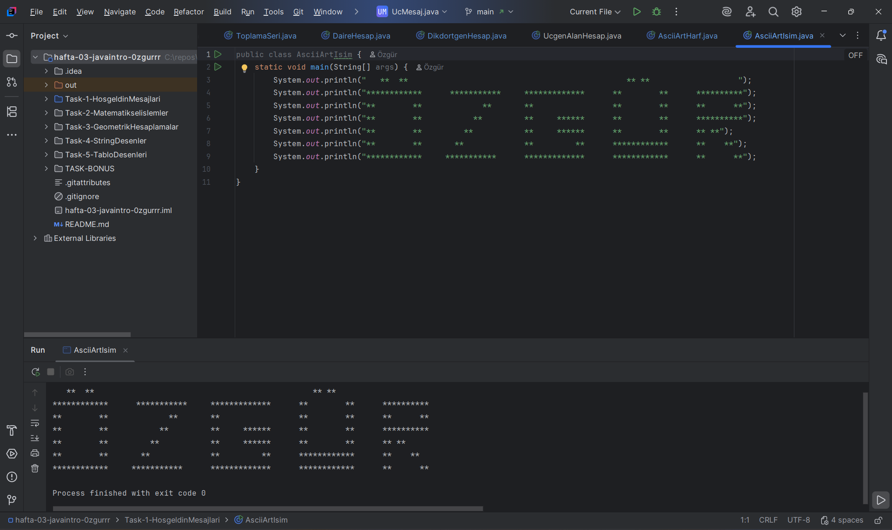
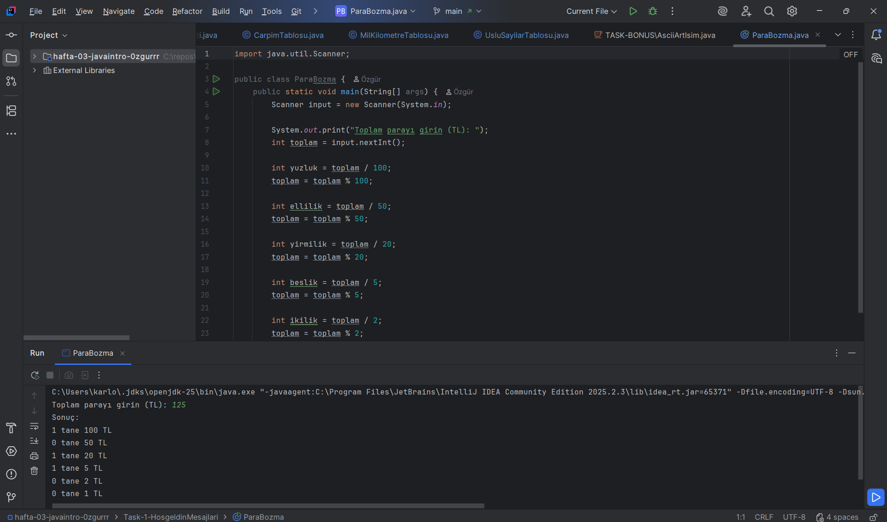
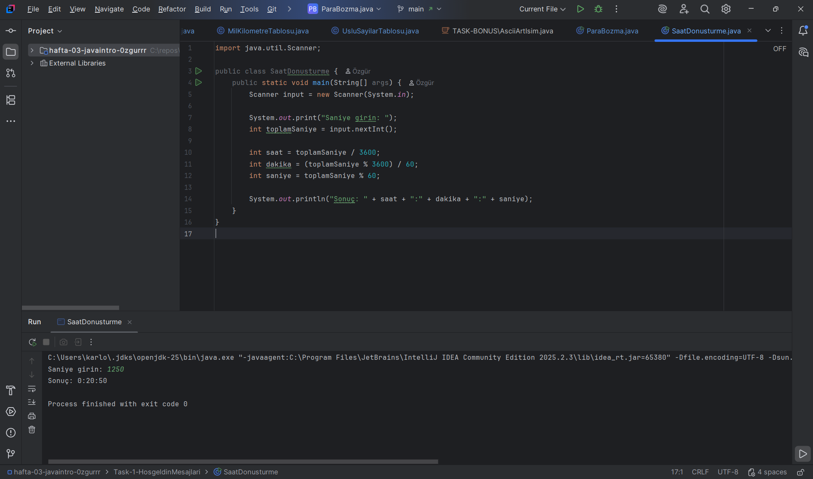
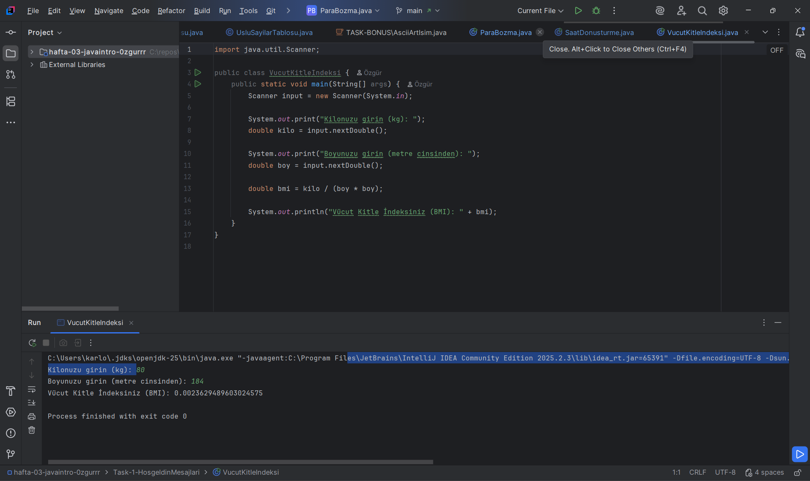

### İsim - Soy isim: Özgür Uluganyan
### Öğrenci No: 250541083

### AÇILAMA 
Bu bonus ödevlerde, Java ile para bozma işlemi, saat-saniye dönüşümü ve vücut kitle indeksi (BMI) hesaplama programları yapılmıştır. Programlar basit hesaplamalar yaparak sonucu ekranda gösterir.

### ASCİİ ART İSİM

### PARA BOZMA

### SAAT DÖNÜŞTÜRME 

### VUCÜT KİTLE İNDEKSİ

