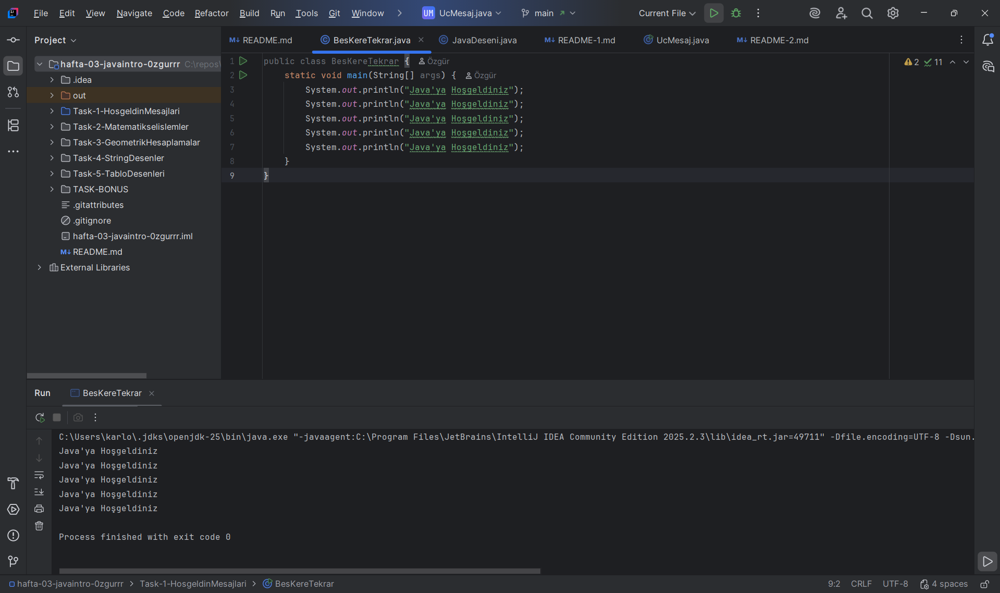
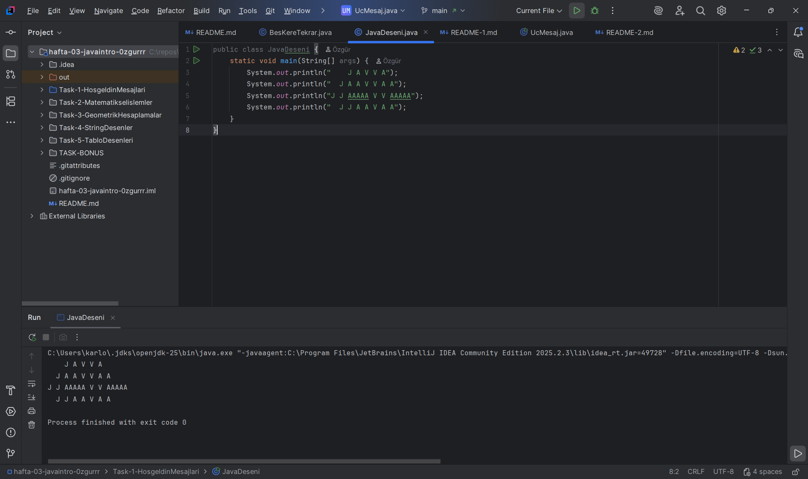
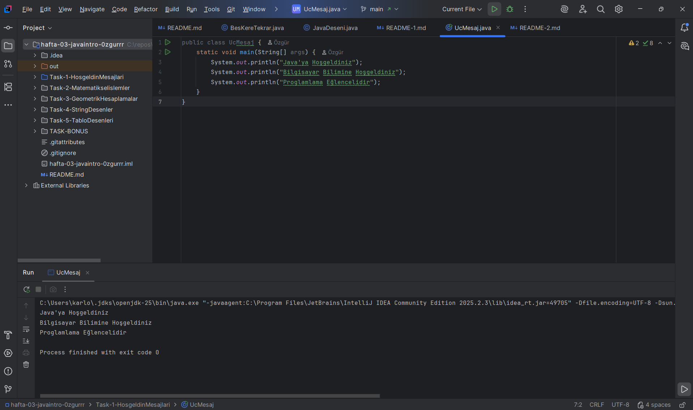

### İsim - Soy isim: Özgür Uluganyan
### Öğrenci No: 250541083

### Açıklama
Her yazdırma işlemi için ayrı bir System.out.println() komutu kullanılmıştır.
Amaç, tekrarlı çıktı üretme mantığını öğrenmek ve println komutunun nasıl çalıştığını anlamaktır.

### Beş Kere Tekrar

### Java Deseni

### Üç Mesaj
