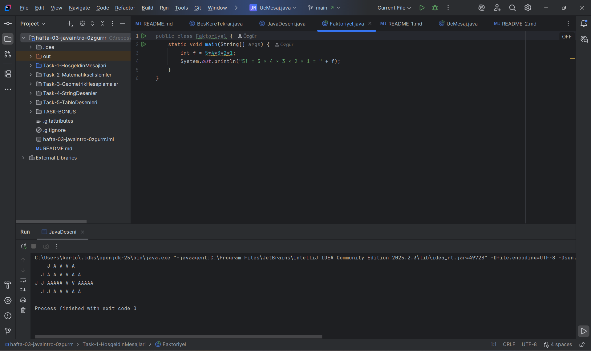
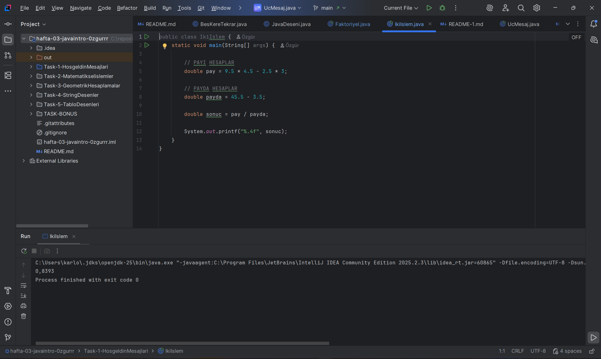
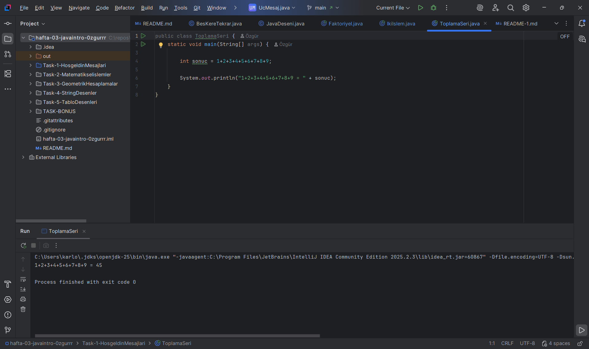

### AÇIKLAMA
Bu bölümde Java kullanarak matematiksel işlemler yapılmıştır.
Programlarda faktöriyel hesaplama, toplama serisi gibi örnekler yer alır.

### FAKTÖRİYEL

### İKİ İŞLEM 

### TOPLAMA SERİ

