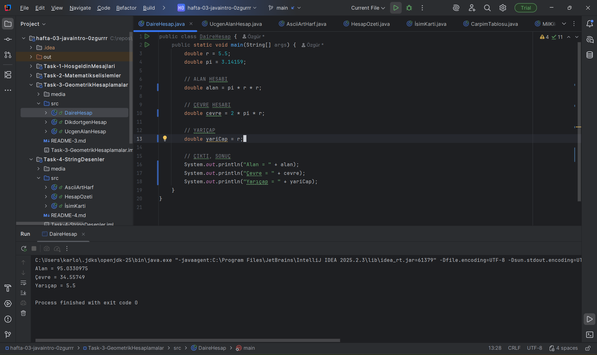

### AÇIKLAMA 
Bu ödevde Java kullanılarak daire, dikdörtgen ve üçgen alanları hesaplanmıştır.
Amaç, matematiksel formülleri programa dönüştürmek ve değişken, işlem ve çıktı üretme konularını pekiştirmektir.

# ÜÇGEN ALAN HESAP

# DAİRE ALAN, ÇEVRE HESAP

### DİKDÖRTGEN HESAP

