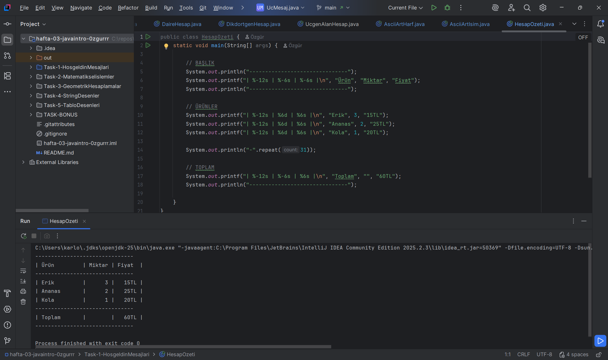
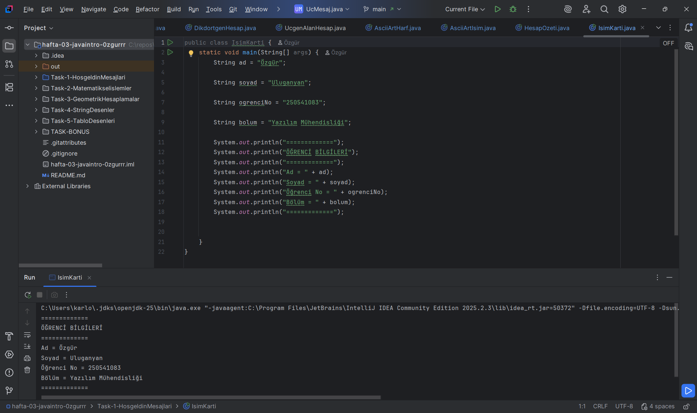

### AÇIKLAMA
Bu Java ödevlerinde, ASCII karakterleri kullanarak harfler ekrana yazdırılmış, ürünlerin miktar ve fiyatları tablo şeklinde gösterilerek hesap özetlenmiş ve basit bir isim kartı oluşturulmuştur.

### ASCİİ ART HARF

### HESAP ÖZETİ

### İSİM KARTI

