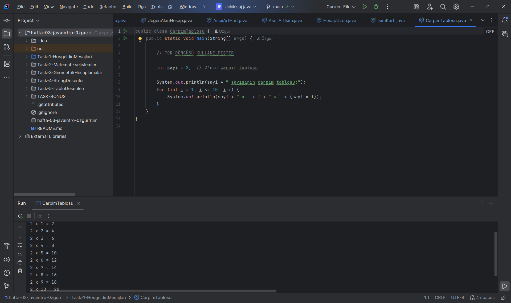
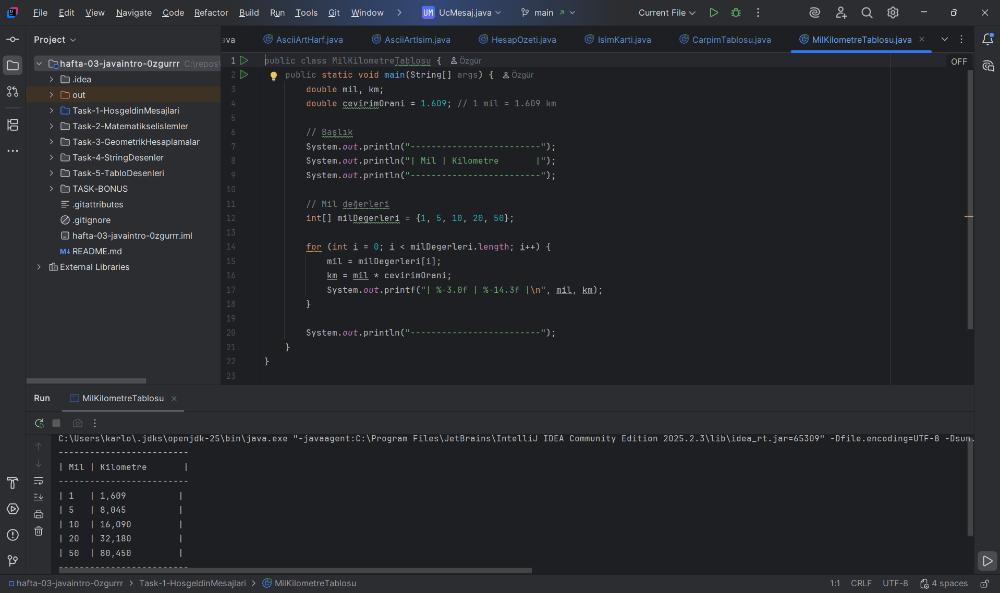
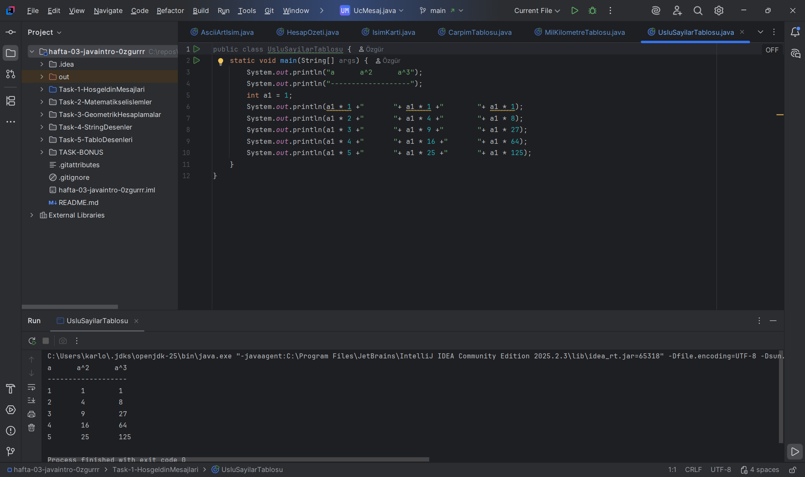

### AÇIKLAMA 
Bu ödevde, Java ile çarpım tablosu, üslü sayılar tablosu ve mil-kilometre dönüşüm tablosu gibi temel tablolar hazırlanmıştır. Programlar kullanıcıya bilgi sunmak için hesaplama ve tablo görüntüleme işlemleri yapar.

### ÇARPIM TABLOSU

### MİL, KİLOMETRE TABLOSU

### ÜSLÜ SAYILAR TABLOSU

